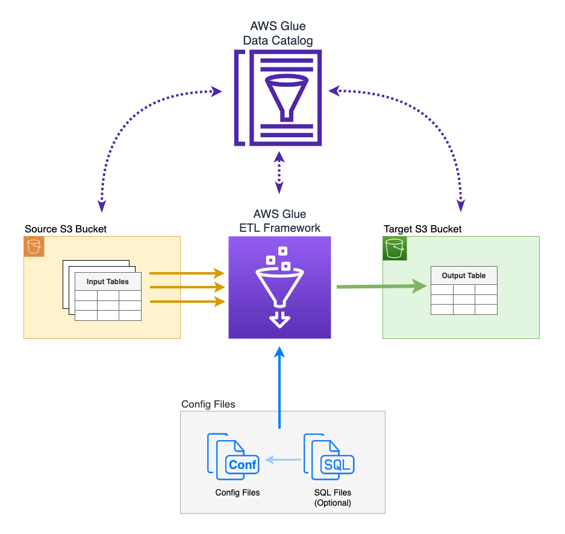

# **Glue Project**

Framework modular para desenvolvimento e execução de **pipelines ETL** com **AWS Glue**. Suporta ambientes locais (desenvolvimento e testes) e produção, integrando-se com **S3**, **Data Catalog** e outros serviços AWS.

---

## **Estrutura do Projeto**

```plaintext
.
├── configs/                     # Configurações do pipeline
│   ├── config.yml
│   └── variables.yml
├── logs/
│   └── app.log
├── modules/
│   ├── __init__.py
│   ├── config_handler.py
│   ├── s3_handler.py
│   ├── logger.py
│   └── job_runner.py
├── notebooks/
│   ├── job1_notebook.ipynb
│   └── job2_notebook.ipynb
├── requirements.txt
└── README.md
```

---

## **Funcionalidades**

- **Desenvolvimento Local:**
  - Teste e debug de pipelines ETL com PySpark e boto3.
  - Notebooks compatíveis com o Glue.

- **Execução no AWS Glue:**
  - Integração total para executar notebooks no Glue Studio.

- **Módulos Reutilizáveis:**
  - Operações com S3, configuração, logging e orquestração de jobs.

---

## **Pré-requisitos**

- **AWS CLI configurada:**

  ```bash
  aws configure
  ```

- **Instalação de Dependências Python:**

  ```bash
  pip install -r requirements.txt
  ```

- **Ambiente de Desenvolvimento:**
  - Jupyter Notebook ou VS Code configurado para executar notebooks localmente.

---

## **Como Usar**

### 1. Configuração Inicial

Edite os arquivos em `configs/`:

- **config.yml:** Defina os parâmetros do pipeline.
- **variables.yml:** Configure variáveis de ambiente.

### 2. Desenvolvimento Local

#### 2.1 Executando Notebooks

Abra qualquer notebook na pasta `notebooks/` no VS Code ou Jupyter Notebook.

**Exemplo de código no notebook:**

```python
from awsglue.context import GlueContext
from pyspark.sql import SparkSession

# Configuração do Spark e GlueContext
spark = SparkSession.builder.appName("GlueNotebook").getOrCreate()
glueContext = GlueContext(spark.sparkContext)

# Ler dados do S3
df = glueContext.create_dynamic_frame.from_options(
    connection_type="s3",
    format="csv",
    connection_options={"paths": ["s3://innodata-etl-dev/input/templates/template1.csv"]},
    format_options={"withHeader": True}
).toDF()

# Mostrar os dados
df.show()

# Processar e salvar no S3
df.write.parquet("s3://innodata-etl-dev/output/processed_data.parquet", mode="overwrite")
```

Execute cada célula e valide os resultados.

### 3. Subir para o AWS Glue

1. **Upload dos Notebooks:**

   ```bash
   aws s3 cp notebooks/job1_notebook.ipynb s3://innodata-etl-dev/notebooks/
   ```

2. **Configuração no Glue Studio:**
   - Acesse **Jobs** e clique em **Notebook**.
   - Selecione o arquivo `.ipynb` no S3.
   - Configure o role de execução e execute o job.

### 4. Estrutura dos Arquivos de Configuração

- **configs/config.yml**

  ```yaml
  pipeline_name: "extract_transform_load"

  variables:
    extract_transform_load:
      s3_bucket: "innodata-etl-dev"
      input_key_prefix: "input/templates/"
      output_path: "output/processed_data/"

  job:
    type: "notebook"  # ou "python-script"
    spark_config:
      - "spark.executor.memory=2g"
      - "spark.executor.cores=2"
  ```

- **configs/variables.yml**

  ```yaml
  default:
    aws_region: "us-east-1"
    log_level: "INFO"

  development:
    s3_bucket: "dev-bucket"
    log_level: "DEBUG"

  production:
    s3_bucket: "prod-bucket"
    log_level: "INFO"
  ```

---

## **Próximos Passos**

- Automatizar o upload de notebooks para o Glue com um script Python.
- Implementar um pipeline CI/CD para sincronizar o projeto com o Glue automaticamente.
- Testar jobs com datasets maiores no ambiente de produção.


## **DIAGRAMA INICIAL**



